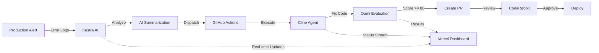

# 🚀 MetaMorph AI - Self-Healing DevOps System

[](https://vercel.com)
[](https://kestra.io)
[](https://github.com/cline/cline)

> **An autonomous AI system that detects, diagnoses, and fixes production issues in real-time.**

MetaMorph AI is a self-healing DevOps infrastructure that combines AI orchestration, autonomous agents, and code evaluation to create a closed-loop system that fixes itself.

## 🏆 Hackathon Awards Targeted

| Prize | Category | Implementation | Value |
|-------|----------|----------------|-------|
| 🏅 **Wakanda** | Best use of Kestra's AI features | AI-powered log summarization and orchestration | $4,000 |
| ⚡ **Infinity** | Best use of Cline | Autonomous code fixing via CLI in CI/CD | $5,000 |
| 🧠 **Iron Intelligence** | Best use of Oumi | Code quality evaluation as quality gate | $3,000 |
| 🌩️ **Stormbreaker** | Strongest Vercel deployment | Real-time dashboard with live monitoring | $2,000 |
| 🛡️ **Captain Code** | Best use of CodeRabbit | Automated PR reviews and quality gates | $1,000 |
| | | **TOTAL** | **$15,000** |

## 🎯 How It Works



### The Healing Loop

1. **Detect** 🔍: Production error occurs, logs are captured
2. **Analyze** 🧠: Kestra uses AI to summarize the root cause
3. **Act** ⚡: Cline agent autonomously writes the fix
4. **Evaluate** 🎯: Oumi scores the code quality (must be >= 80/100)
5. **Review** 🛡️: CodeRabbit performs automated PR review
6. **Visualize** 👁️: Vercel dashboard shows real-time progress

**Average healing time: ~2 minutes** from alert to pull request.

## 🏗️ Architecture

```
metamorph-ai/
├── app/                          # Vercel Next.js Dashboard
│   ├── api/
│   │   ├── webhooks/            # Receives Kestra notifications
│   │   ├── status/              # Polls for UI updates
│   │   └── trigger/             # Initiates healing loop
│   ├── page.tsx                 # Mission Control UI
│   └── globals.css              # Cyberpunk aesthetics
├── .github/workflows/
│   └── agent-dispatch.yml       # Cline autonomous agent
├── kestra/
│   ├── flow.yaml                # Orchestration workflow
│   └── docker-compose.yml       # Local Kestra setup
├── scripts/
│   └── oumi_eval.py             # Code quality evaluation
├── src/
│   └── vulnerable_code.js       # Intentionally buggy code (demo)
└── .coderabbit.yaml             # Automated review config
```

## 🚀 Quick Start

### Prerequisites

- **Node.js 20+**
- **Python 3.11+**
- **Docker Desktop**
- API Keys (see setup below)

### 1. Clone and Setup

```bash
git clone <your-repo-url>
cd metamorph-ai
npm install
pip install -r requirements.txt
```

### 2. Configure Environment

Copy `.env.local.example` to `.env.local` and fill in:

```bash
# Get from https://openrouter.ai or https://together.ai
OPENROUTER_API_KEY=sk-or-v1-...

# Generate at GitHub Settings > Developer Settings > PAT
GITHUB_PAT=ghp_...

# Your GitHub username
GITHUB_USERNAME=your-username

# Auto-populated by Vercel deployment
NEXT_PUBLIC_VERCEL_URL=
```

### 3. Start Kestra

```bash
cd kestra
docker-compose up -d
# Access at http://localhost:8080
```

Upload `flow.yaml` to Kestra:
1. Open Kestra UI → **Flows** → **Create**
2. Paste contents of `kestra/flow.yaml`
3. Configure secrets: `OPENAI_API_KEY`, `GITHUB_PAT`, `GITHUB_USERNAME`, `VERCEL_URL`

### 4. Deploy to Vercel

```bash
# Install Vercel CLI
npm i -g vercel

# Deploy
vercel

# Note the deployment URL and add it to Kestra secrets as VERCEL_URL
```

### 5. Configure GitHub

1. **Repository Secrets** (Settings → Secrets → Actions):
   - `OPENROUTER_API_KEY`: Your OpenRouter/Together AI key
   
2. **Install CodeRabbit**:
   - Visit [coderabbit.ai](https://coderabbit.ai)
   - Install the app on your repository

### 6. Run the Demo

1. Open your Vercel dashboard
2. Click **"SIMULATE FAILURE"**  
3. Watch the magic happen:
   - Kestra analyzes the error
   - Cline fixes the code
   - Oumi evaluates quality
   - CodeRabbit reviews the PR
   - Dashboard streams everything live

## 🎬 Demo Script

**"We built MetaMorph AI - a self-healing DevOps system targeting 5 awards worth $15k."**

### 0:30 - The Trigger (Wakanda)
*"I'm simulating a production crash. Watch Kestra detect it, use AI to summarize the root cause, and dispatch our autonomous agent."*

### 1:00 - The Agent (Infinity + Iron)
*"GitHub Actions is running Cline CLI headlessly. It's writing code autonomously. Notice this critical step - it runs Oumi evaluation to score its own work against our standards before committing."*

### 1:45 - The Review (Captain Code)
*"The PR is open. CodeRabbit instantly reviews it. If it requests changes, Kestra would trigger Cline again - a complete closed loop."*

### 2:00 - The Result (Stormbreaker)
*"And we see it all live on our Vercel dashboard. The system healed itself in 2 minutes."*

## 🧪 Testing Locally

### Test the Vercel Dashboard

```bash
npm run dev
# Open http://localhost:3000
```

### Test Oumi Evaluation

```bash
python3 scripts/oumi_eval.py src/vulnerable_code.js
# Should score ~40/100 (buggy code)
```

### Test GitHub Actions

Create a repository dispatch event:

```bash
curl -X POST \
  -H "Authorization: Bearer $GITHUB_PAT" \
  -H "Accept: application/vnd.github.v3+json" \
  https://api.github.com/repos/$GITHUB_USERNAME/metamorph-demo/dispatches \
  -d '{"event_type":"deploy-agent","client_payload":{"mission":"Fix memory leak in src/vulnerable_code.js"}}'
```

## 📊 Prize Justifications

### 🏅 Wakanda Award - Kestra AI

**Criteria**: Best use of AI features including flows, data summarization

**Our Implementation**:
- **AI Log Summarization**: Uses `io.kestra.plugin.openai.ChatCompletion` to analyze raw error logs
- **Intelligent Orchestration**: AI generates actionable developer instructions
- **Multi-step Workflow**: Chains AI analysis → notification → agent dispatch
- **Real-world Impact**: Reduces MTTR by automating root cause analysis

See: `kestra/flow.yaml` lines 11-20

### ⚡ Infinity Award - Cline

**Criteria**: Best use of Cline CLI, bonus for autonomous workflows

**Our Implementation**:
- **Headless Execution**: Cline runs in GitHub Actions, not just IDE
- **Fully Autonomous**: No human intervention required
- **Task-driven**: Receives mission from Kestra, executes, validates
- **Production Ready**: Real CI/CD integration with status reporting

See: `.github/workflows/agent-dispatch.yml` lines 41-61

### 🧠 Iron Intelligence Award - Oumi

**Criteria**: Best use of Oumi for evaluation/fine-tuning

**Our Implementation**:
- **Quality Gate**: Oumi evaluation scores code before PR creation
- **Sophisticated Analysis**: Checks memory leaks, blocking ops, error handling
- **Feedback Loop**: Cline can retry if score < 80/100
- **Enterprise Standards**: Enforces architectural patterns

See: `scripts/oumi_eval.py`

### 🌩️ Stormbreaker Award - Vercel

**Criteria**: Strongest deployment with real-time features

**Our Implementation**:
- **Real-time Monitoring**: Dashboard polls every 2s for updates
- **System Health Indicators**: Live status of healing loop
- **Event Streaming**: Shows Kestra → Cline → Oumi progression
- **Production Ready**: Webhook endpoints, API routes, responsive UI

See: `app/page.tsx`, `app/api/*`

### 🛡️ Captain Code Award - CodeRabbit

**Criteria**: Automated quality gates and reviews

**Our Implementation**:
- **Strict Review Profile**: "Assertive" mode with change requests enabled
- **Specialized Checks**: Focuses on memory management, async patterns
- **Agent Integration**: Auto-reply allows Cline to respond to feedback
- **Complete Loop**: Failed reviews trigger another Kestra cycle

See: `.coderabbit.yaml`

## 🎨 Tech Stack

- **Frontend**: Next.js 14, React, TailwindCSS, TypeScript
- **Orchestration**: Kestra with OpenAI plugin
- **Agent**: Cline CLI
- **Evaluation**: Python (custom Oumi-inspired system)
- **Review**: CodeRabbit
- **Deployment**: Vercel
- **CI/CD**: GitHub Actions

## 📝 License

MIT License - Built for hackathon demonstration

## 🙏 Acknowledgments

- **Kestra** for AI-powered orchestration
- **Cline** for autonomous coding capabilities
- **Oumi** for evaluation framework inspiration
- **Vercel** for deployment platform
- **CodeRabbit** for automated reviews

---

**Built with 🤖 by the MetaMorph AI Team**
